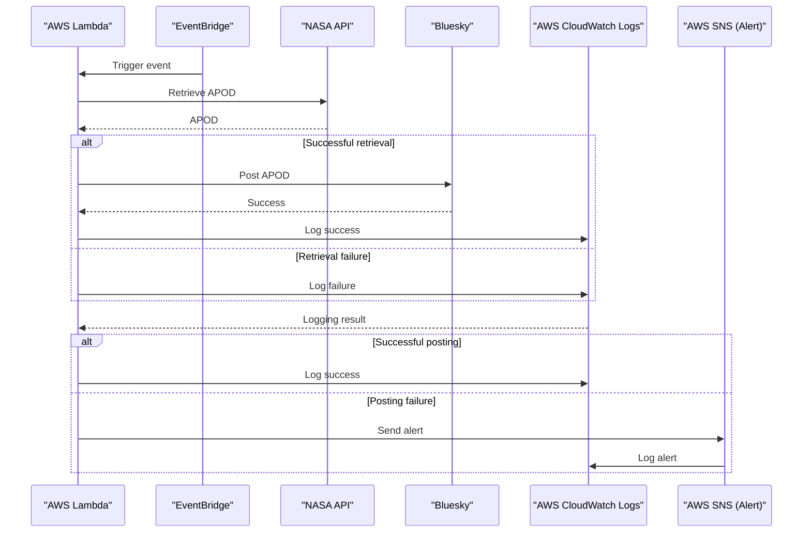

# Bluesky APOD Bot

```mermaid
sequenceDiagram;
    participant Lambda as "AWS Lambda";
    participant EventBridge as "EventBridge";
    participant NASA_API as "NASA API";
    participant Bluesky as "Bluesky";
    participant CloudWatch as "AWS CloudWatch Logs";
    participant SNS as "AWS SNS (Alert)";

    EventBridge ->> Lambda: Trigger event
    Lambda ->> NASA_API: Retrieve APOD
    NASA_API -->> Lambda: APOD
    alt Successful retrieval
        Lambda ->> Bluesky: Post APOD
        Bluesky -->> Lambda: Success
        Lambda ->> CloudWatch: Log success
    else Retrieval failure
        Lambda ->> CloudWatch: Log failure
    end

    CloudWatch -->> Lambda: Logging result

    alt Successful posting
        Lambda ->> CloudWatch: Log success
    else Posting failure
        Lambda ->> SNS: Send alert
        SNS ->> CloudWatch: Log alert
    end
```
